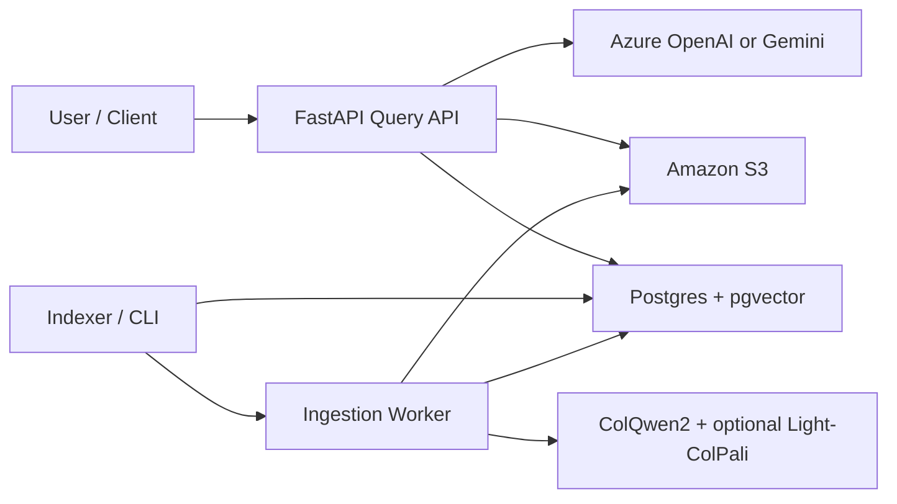
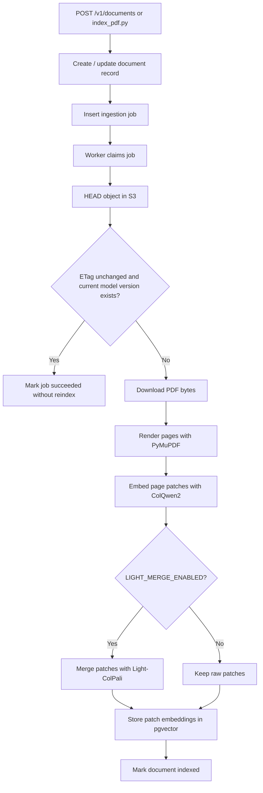
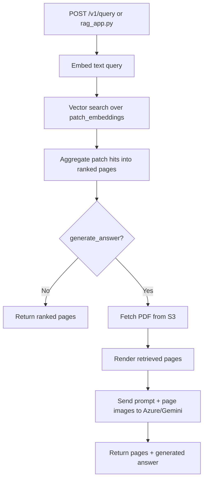
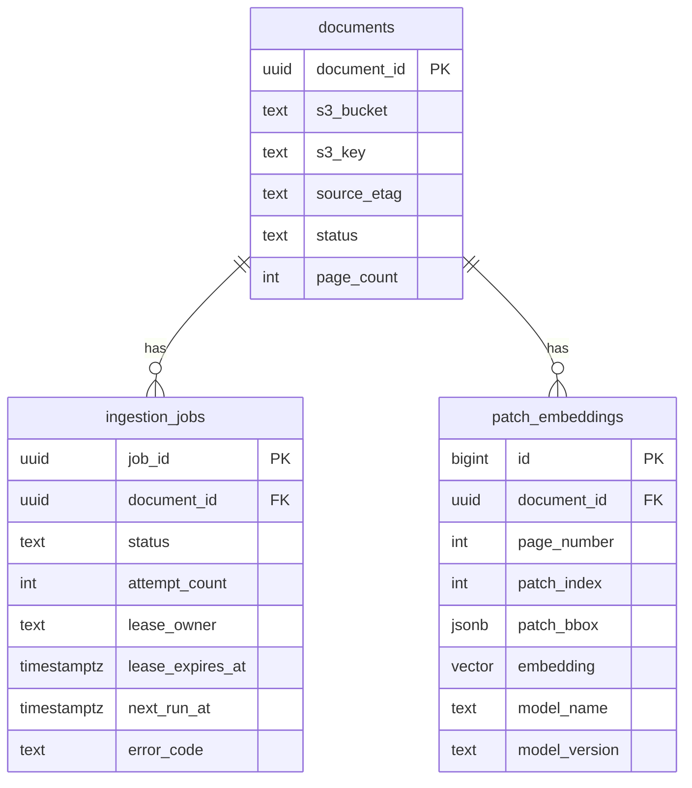

# VisionRAG

VisionRAG is a PDF-first retrieval system that indexes document pages as visual patch embeddings and serves page-level retrieval through a FastAPI API, a background ingestion worker, and a small local CLI.

The application is built around ColQwen2/ColPali-style visual embeddings, stores page patch vectors in Postgres with `pgvector`, reads source PDFs from S3, and can optionally generate answers from the retrieved page images using Azure OpenAI or Gemini.

## What It Does

- Ingests PDFs from S3 into a durable job queue.
- Renders PDF pages to images with PyMuPDF.
- Embeds each page into patch-level visual vectors.
- Optionally applies Light-ColPali token merging during ingestion to reduce stored patch count.
- Stores patch embeddings, page metadata, and ingestion state in Postgres.
- Retrieves relevant pages for a query through vector search plus page-level reranking.
- Optionally sends the retrieved page images to a multimodal LLM for answer generation.

## Architecture



## Main Flows

### Ingestion Flow



### Query Flow



## Components

- [`run_api.py`](run_api.py): starts the FastAPI application on port `8000`.
- [`run_worker.py`](run_worker.py): runs the background ingestion worker forever.
- [`index_pdf.py`](index_pdf.py): queues one PDF ingestion job and can process it immediately for local testing.
- [`rag_app.py`](rag_app.py): interactive CLI for retrieval and optional answer generation.
- [`visionrag/api/app.py`](visionrag/api/app.py): API endpoints and wiring.
- [`visionrag/services/worker_service.py`](visionrag/services/worker_service.py): job claiming, retries, page rendering, embedding, and persistence.
- [`visionrag/services/query_service.py`](visionrag/services/query_service.py): query embedding, vector search, reranking, and answer generation.
- [`visionrag/providers/embedding.py`](visionrag/providers/embedding.py): ColQwen2 loading, page embedding, query embedding, and ingestion observability.
- [`visionrag/Light_merge.py`](visionrag/Light_merge.py): Light-ColPali hierarchical token-merging implementation.
- [`visionrag/db/migrations/001_init.sql`](visionrag/db/migrations/001_init.sql): schema for documents, ingestion jobs, patch embeddings, and migrations.

## Data Model



## Requirements

- Python 3.10+
- Postgres with the `pgvector` extension available
- AWS credentials with access to the target S3 bucket
- A ColQwen2/ColPali-compatible model from Hugging Face
- Optional:
  - Azure OpenAI credentials for answer generation
  - Gemini API key for answer generation or fallback

## Installation

```bash
pip install -r requirements.txt
```

## Configuration

Copy [`.env.example`](.env.example) to `.env` and set the values you need.

### Core Settings

| Variable | Required | Purpose |
| --- | --- | --- |
| `POSTGRES_DSN` | Yes | Postgres connection string. |
| `AWS_ACCESS_KEY_ID` | Usually | S3 access. |
| `AWS_SECRET_ACCESS_KEY` | Usually | S3 access. |
| `AWS_REGION` | No | AWS region for S3 client. |
| `DEFAULT_S3_BUCKET` | No | Default bucket for ingestion requests. |

### Embedding and Light-ColPali

| Variable | Required | Purpose |
| --- | --- | --- |
| `COLPALI_MODEL_NAME` | No | Embedding model name, default `vidore/colqwen2-v1.0`. |
| `COLPALI_MODEL_VERSION` | No | Logical embedding version stored in Postgres. Change this when you want a fresh index namespace. |
| `COLPALI_DEVICE` | No | Embedding device, for example `cpu` or `cuda`. |
| `LIGHT_MERGE_ENABLED` | No | Enables Light-ColPali patch merging during ingestion. |
| `LIGHT_MERGE_FACTOR` | No | Target reduction ratio, default `9`. |
| `LIGHT_MERGE_MIN_CLUSTERS` | No | Minimum number of merged clusters per page. |
| `LIGHT_MERGE_BBOX_DENSITY_PERCENTILE` | No | Controls how merged patch boxes are spatially tightened. |

### Query and Rendering

| Variable | Required | Purpose |
| --- | --- | --- |
| `QUERY_DEFAULT_TOP_K_PATCHES` | No | Number of patch hits pulled from vector search. |
| `QUERY_DEFAULT_TOP_K_PAGES` | No | Number of pages returned by default. |
| `QUERY_PAGE_TOP_M_PATCHES` | No | Patch hits per page used when reranking. |
| `QUERY_MAX_PAGES_PER_DOCUMENT` | No | Diversity limit per document. |
| `RENDER_DPI` | No | DPI used when rendering PDF pages into images. |

### Worker and Operations

| Variable | Required | Purpose |
| --- | --- | --- |
| `WORKER_POLL_INTERVAL_SECONDS` | No | Sleep interval when the queue is empty. |
| `WORKER_LEASE_SECONDS` | No | Lease time for claimed jobs. |
| `WORKER_MAX_ATTEMPTS` | No | Retry budget before dead-lettering. |
| `WORKER_RETRY_BASE_SECONDS` | No | Exponential backoff base delay. |
| `WORKER_RETRY_MAX_SECONDS` | No | Maximum retry delay. |
| `WORKER_LEASE_REFRESH_EVERY_PAGES` | No | Lease renewal frequency during large documents. |
| `LOG_LEVEL` | No | Logging level. |
| `METRICS_ENABLED` | No | Parsed by settings, though metrics are currently in-memory only. |

### Answer Generation

| Variable | Required | Purpose |
| --- | --- | --- |
| `AZURE_OPENAI_ENDPOINT` | Optional | Azure multimodal answer generation. |
| `AZURE_OPENAI_API_KEY` | Optional | Azure multimodal answer generation. |
| `AZURE_OPENAI_API_VERSION` | No | Azure OpenAI API version. |
| `AZURE_OPENAI_DEPLOYMENT` | Optional | Azure deployment/model name. |
| `GEMINI_API_KEY` | Optional | Gemini answer generation or fallback. |
| `GEMINI_MODEL` | No | Gemini model name. |

## Database Setup

Apply migrations:

```bash
python migrate.py
```

This creates:

- `documents`
- `ingestion_jobs`
- `patch_embeddings`
- `schema_migrations`

It also ensures the `vector` extension exists.

## Running the Application

### Start the API

```bash
python run_api.py
```

The API listens on `http://localhost:8000`.

### Start the Worker

```bash
python run_worker.py
```

### Queue and Process One Document Locally

```bash
python index_pdf.py --s3-key sample.pdf --process-now
```

If `DEFAULT_S3_BUCKET` is not set:

```bash
python index_pdf.py --s3-bucket my-bucket --s3-key docs/my.pdf --process-now
```

### Use the Local Query CLI

```bash
python rag_app.py
```

## API Reference

### Health

```bash
curl http://localhost:8000/healthz
curl http://localhost:8000/readyz
curl http://localhost:8000/metrics
```

### Queue a Document

```bash
curl -X POST http://localhost:8000/v1/documents \
  -H "Content-Type: application/json" \
  -d '{"s3_bucket":"my-bucket","s3_key":"docs/my.pdf"}'
```

### Force Re-ingestion

```bash
curl -X POST http://localhost:8000/v1/documents \
  -H "Content-Type: application/json" \
  -d '{"s3_bucket":"my-bucket","s3_key":"docs/my.pdf","force":true}'
```

### Check Job Status

```bash
curl http://localhost:8000/v1/jobs/<job-id>
```

### Query for Relevant Pages

```bash
curl -X POST http://localhost:8000/v1/query \
  -H "Content-Type: application/json" \
  -d '{"query":"What does the revenue chart show?","generate_answer":false}'
```

### Query and Generate an Answer

```bash
curl -X POST http://localhost:8000/v1/query \
  -H "Content-Type: application/json" \
  -d '{"query":"What does the revenue chart show?","generate_answer":true}'
```

## Light-ColPali Notes

When `LIGHT_MERGE_ENABLED=true`, ingestion reduces the number of stored patch embeddings per page by clustering semantically similar patches after the projector stage.

During ingestion, the app logs:

- `raw_patch_count`
- `merged_patch_count`
- `merge_ratio`
- `merge_enabled`

Example observed behavior for `sample.pdf`:

- Raw patches per page: `720`
- Merged patches per page: `80`
- Merge ratio: `0.1111`

Important operational note:

- Light-ColPali changes ingestion-time storage and retrieval density.
- It does not reduce multimodal LLM image tokens during answer generation, because answer generation still sends rendered page images to Azure OpenAI or Gemini.

## Reindexing Behavior

The worker skips reindexing when all of the following are true:

- the S3 object ETag has not changed
- the document already has embeddings for the current `model_name`
- the document already has embeddings for the current `model_version`

Use one of these when you need a rebuild:

- send `force=true` to `POST /v1/documents`
- use `index_pdf.py` for a one-off ingest
- change `COLPALI_MODEL_VERSION` when the embedding format or ingestion strategy changes

## Answer Generation Behavior

Answer generation is optional.

- If Azure is configured, Azure OpenAI is used.
- If Gemini is configured, Gemini is used.
- If both are configured, Azure is primary and Gemini is fallback.
- If neither is configured, retrieval still works, but `generate_answer=true` will fail.

## Testing

```bash
pytest tests
```

Current test coverage is focused on:

- reranking behavior
- worker retry backoff

## Project Layout

```text
visionrag/
  api/            FastAPI app and request/response schemas
  db/             migrations and repository layer
  providers/      S3, rendering, embedding, answer generation
  services/       ingestion and query orchestration
  Light_merge.py  Light-ColPali token merging
  rerank.py       page reranking logic
  config.py       environment-backed settings
```

## Known Constraints

- Embeddings are stored as patch-level vectors in Postgres, so large collections still depend on database sizing and HNSW tuning.
- Query embedding currently mean-pools the query token vectors into a single vector.
- Answer generation uses full rendered page images, which can dominate cost even when Light-ColPali is enabled.
- Metrics are process-local and in-memory; they are not yet exported to an external monitoring backend.
